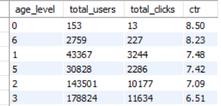
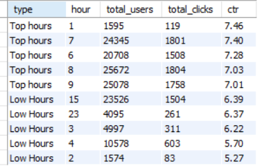
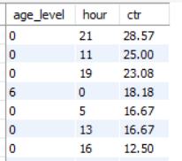

# Ad_click_analysis

**Project Overview:**

This project focuses on analyzing user interaction with online advertisements to understand click behavior and identify factors influencing engagement. The primary goal is to evaluate ad performance using key metrics like Click-Through Rate (CTR), uncover high-performing and underperforming segments, and identify hidden growth opportunities.

The analysis was carried out using exploratory data analysis (EDA), SQL queries, and interactive dashboards to derive meaningful insights related to user demographics, product performance, time-based engagement, and webpage effectiveness.

**Dataset Description:**

The dataset contains user-level ad interaction data where each row represents an advertisement impression shown to a user.

It includes information about whether the user clicked on the ad, along with attributes related to user demographics, product, campaign, and time.

**Key Columns Include:**

is_click → Indicates whether the ad was clicked (1 = Yes, 0 = No)
product → Product category displayed in the ad
campaign_id → Campaign identifier
webpage_id → Webpage where the ad was shown
gender → User gender
age_level → Categorized age group
hour → Hour of ad impression
day_of_week → Day of interaction

**Key Metric:**

Click-Through Rate (CTR)
Defined as:
CTR = Total Clicks / Total Impressions
Used as the primary performance indicator across all segments

**Tools Used:**

MySQL – For writing SQL queries and performing data analysis
Python (Jupyter Notebook) – For data cleaning, preprocessing, and exploratory analysis
Power BI – For building interactive dashboards and visualizing key insights

**Key Insights:**

1. Overall CTR(Click through rate) is low (6.76%) that is out of 100% of Ad interactions only 6.76% clicked it.

**-> Business Recommendation: Improve Overall Engagement**
- Improve Ad creatives with better visuals & attractive headlines
- Use more personalised ads

2.  Certain age levels such as 0,6,1,5 are likely to click the ads more in comparison to other age levels with higher CTR.

**-> Business Recommendation: Target High-Performing Age Groups**
- Customise ads based on their preferences
- Allocate more budget to these segments

3.  Morning & Midnight are our peak hours where users likely click the ads with high CTR.

**-> Business Recommendation: Optimise Ad timing**
- Show more ads during these hours
- Adjust spending during low-performing hours
  
4.  Lower age level people likely click our ads at night with high CTR i.e 28.57% & also it can be observed that these users are our primary segment with consistent higher CTR across the hours.

**-> Business Recommendation: Focus on Young users at night**
- Use content relevant to their behavior (entertainment, quick offers)
- Peronalise their preferences & Run targeted night campaigns for younger users
  
5. There could be found few hidden opportunity where CTR was comparatively high but user exposure was relatively low such as Product J had high CTR(9.27%) but relatively low user exposure(around 9k) indicating strong potential for scaling ad reach. 

 

**-> Business Recommendation: Scale high-performing products**
- Increase visibilty of the particular product( For eg: Product J)
- Feature it in top campaigns/webpages

