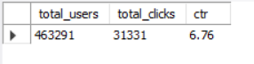
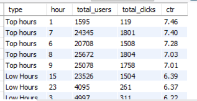
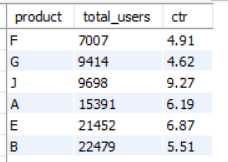

# Ad_click_analysis

**Key Insights:**

1. Overall CTR(Click through rate) is low (6.76%) that is out of 100% of Ad interactions only 6.76% clicked it.

2.  Certain age levels such as 0,6,1,5 are likely to click the ads more in comparison to other age levels with higher CTR.

!ctr_by_Age](images/ctr_by_age.png)

3.  Morning & Midnight are our peak hours where users likely click the ads with high CTR.

4.  Lower age level people likely click our ads at night with high CTR i.e 28.57% & also it can be observed that these users are our primary segment with consistent higher CTR across the hours.

![CTR_byhour_Age] (images/CTR_by_hour_age.png)

5. There could be found few hidden opportunity where CTR was comparatively high but user exposure was relatively low such as Product J had high CTR(9.27%) but relatively low user exposure(around 9k) indicating strong potential for scaling ad reach. 

   
